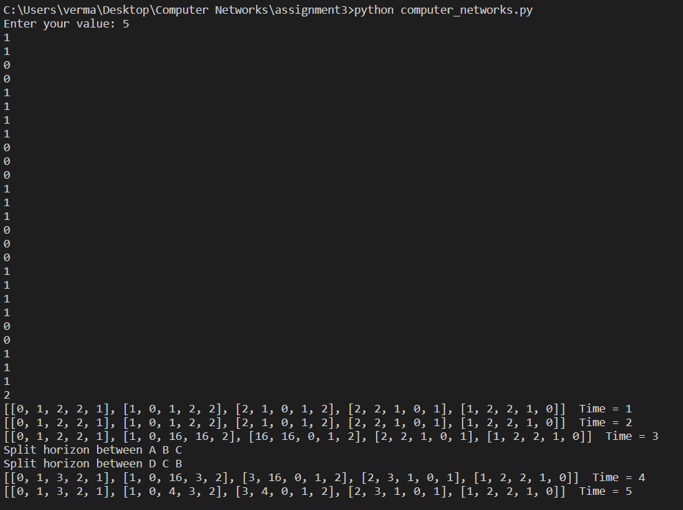

# Computer Networks Assignment-3

This assignment is based on Distance Vector Routing algorithm.
A distance-vector routing protocol determines the best route for data packets based on distance. Distance-vector routing protocols measure the distance by the number of routers a packet has to pass, one router counts as one hop.The protocol uses Bellman-Ford algorithm to achieve this.

## Approach

For completing this assignment I had initially taken a 5X5 matrix to serve as the topology given.Then I had further taken a 5X5X5 matrix to store the information of which node uses which route to reach each other node. This information was essential for implementing the second part since there was a situation where a split horizon was needed to be implemented.

At t=x we know that each node is now reachable to every other node and then at t=x+1 BC link breaks and then at t=x+2 node B and C routing tables are updated as they now cannot reach each other and also nodes A and D respectively (This is necessary to note that the second part of information is also conveyed because else it would be impossible for them to correct it since they can no longer contact each other).

## Answers

For the first part my output was t=1s.

For the second part my output was t=5s.

For each time interval I have shown every routing table and for every split horizon situation I have printed the node's number.(A->0, B->1, C->2, D->3, E->4).

The simple assumption made by me was that at the end of each time cycle itself if all the nodes are connected to each other then I am taking that time interval as the answer(If the instructor wants to take the next time interval then simply a +1 at the end would work!).

Another assumption is that 16 is taken to be infinite or unreachable distance.
Here is a snapshot of the same.


``` terminal

python computer_networks.py

````

I have attached the input.txt file as well. In input first line specifier number of nodes. Then following n*n line describe the topology(each distance is assumed to be 1).
Last two lines show which node links are broken for part (ii).

Submitted by:

Preetesh Verma

2018eeb1171
